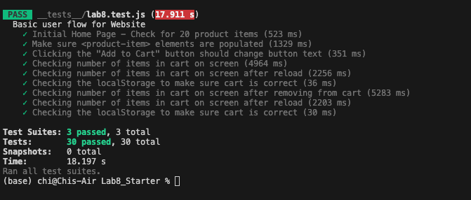
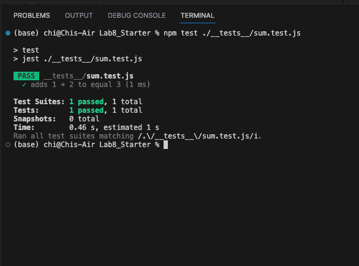
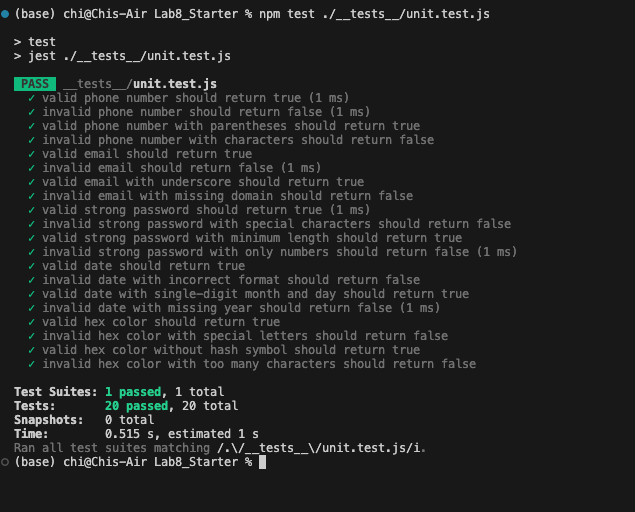

# Lab 8 - Starter
1. Where would you fit your automated tests in your Recipe project development pipeline? Select one of the following and explain why.
> Running tests on GitHub Actions when code is pushed provides benefits like automated testing, continuous integration leading to improved code quality and streamlined development.

2. Would you use an end to end test to check if a function is returning the correct output? (yes/no)
> No

3. Would you use a unit test to test the “message” feature of a messaging application? Why or why not? For this question, assume the “message” feature allows a user to write and send a message to another user.
> Yes, unit tests can be used to test the "message" feature, it ensure that individual components of the code, like creating message, receiving message, and to be correctly functioning.

4. Would you use a unit test to test the “max message length” feature of a messaging application? Why or why not? For this question, assume the “max message length” feature prevents the user from typing more than 80 characters.
> Yes, we can test it using individual test case to validate that the code correctly enforces the maximum character limit.

### Screenshot for testing
npm test

sum test

unit test
